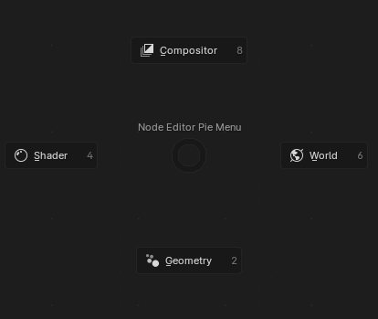

# Node Editor Switcher Blender Addon

## Overview
Add a pie menu, quick buttons, and shortcuts for switching between the different node editors.

## Features
### Pie Menu: 
Accessible in the Node Editor, the pie menu is an easy way to switch between different node editors with a single click.

- Default keyboard shortcuts: `E`
- You can customize these shortcuts in Blender's keymap settings.

### Quick Buttons: 

The Node Editor buttons are available at the top right of the node editor header and can be disabled in the addon preferences.

### Keyboard Shortcuts: 

- Default keyboard shortcuts:
  - `1`: Geometry Node Editor
  - `2`: Shader Node Editor
  - `3`: World Node Editor
  - `4`: Compositor Node Editor
- You can customize these shortcuts in Blender's keymap settings.

## Installation version <=1.0.1
To install the Node Editor Pie addon, follow these steps:
1. Download the `node_editor_pie.zip` file available [here](https://github.com/Victor-IX/NodeEditorSwitcher/releases/latest).
2. In Blender, go to `Edit > Preferences > Add-ons`.
3. Click on `Install...` and select the downloaded `node_editor_pie.zip` file.
4. Enable the addon by ticking the checkbox next to "Node Editor Pie" in the add-ons list.

## Instalation vesrion >1.0.1
Version 1.0.2 and newer are only available on Blender 4.2+ with the [Extension package](https://extensions.blender.org) enabled, and the addon can be installed directly from Blender!

## Compatibility
- Blender version: 4.0 and above

## License
This addon is licensed under the [GNU General Public License v3.0](https://www.gnu.org/licenses/gpl-3.0.html). See the `LICENSE` file for more details.

---

Feel free to reach out if you have any questions, feedback, or suggestions!
